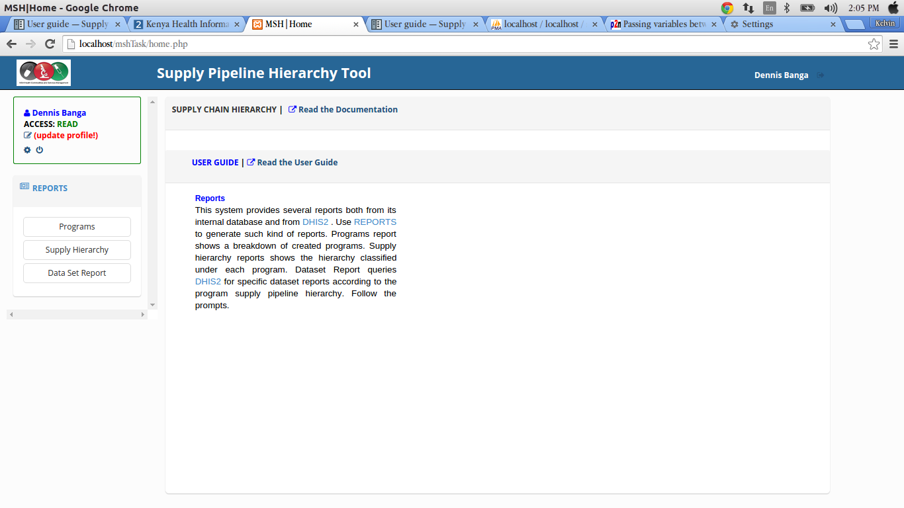
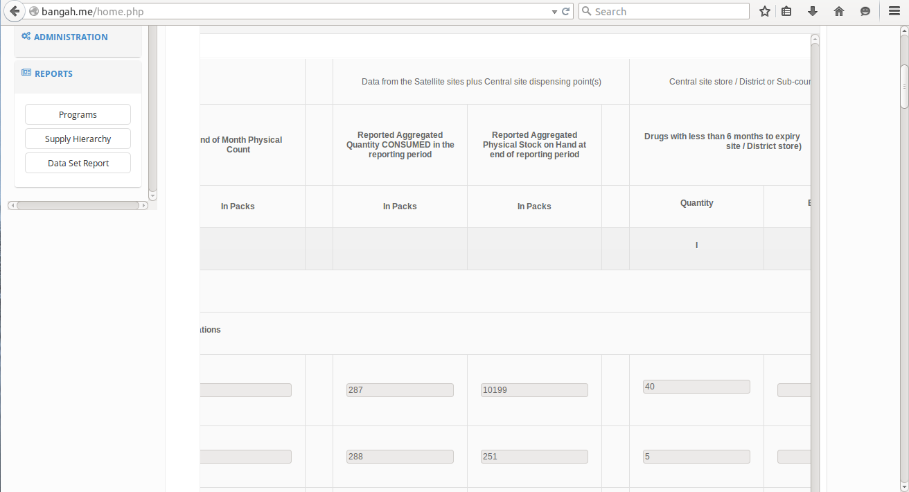
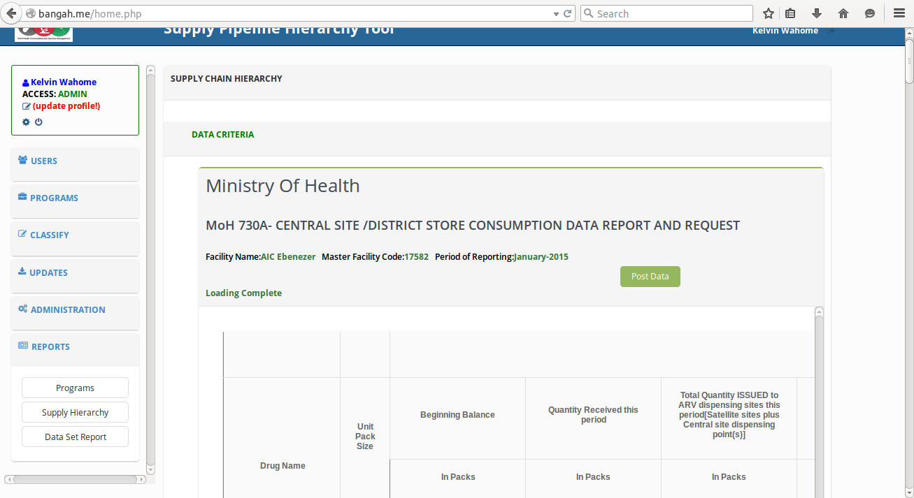
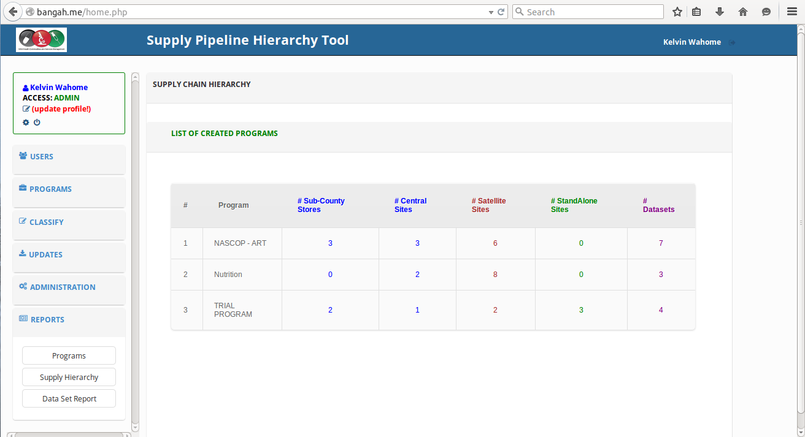
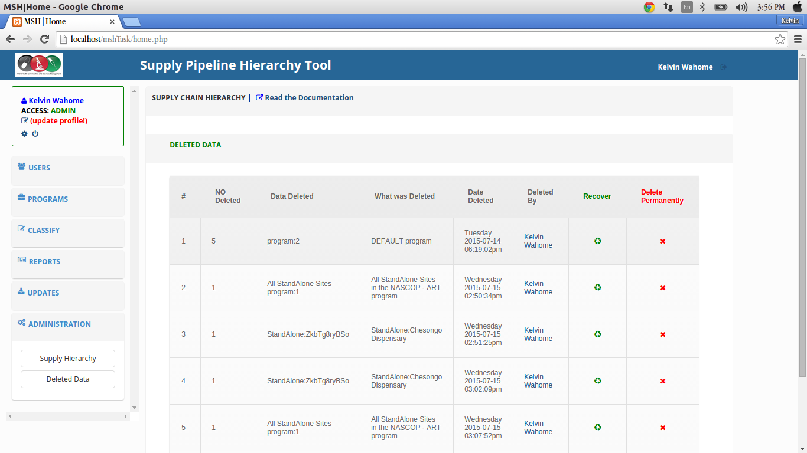

User guide
===========

Introduction
------------
Managing supply chains in support of HIV/AIDS services is a formidable challenge, especially in developing countries. Expanding programs for HIV/AIDS, TB and malaria require strong and supportive laboratory services that depend on the availability of the required commodities to perform critical tests, with most tests requiring multiple commodities to be available simultaneously. A correctly designed and run distribution system should keep the commodities in good condition, rationalize storage points, use transport as efficiently as possible, reduce theft and fraud and provide information for forecasting needs. This requires a good management of the system along with a simple but well-designed information system in place. 
The purpose of this project is to establish an hierarchy of the drugs supply chain that is not captured in DHIS2 for purposes of analysis and report generation.

As things stand, the Kenya instance of `DHIS2`_ only establishes a hierarchy based on the country's administrative units (national, county, sub-county, facility), which while important, does not capture the supply chain hierarchy for ART-related medicines & nutrition commodities.

This supply hierarchy needs to place facilities in their correct order matching the flow of both data/information and health commodities; hence clearly showing the reporting chain i.e. what facilities report to which others, and what facilities report to the national/central  level (NASCOP), hence instituting a parent-child relationship.

.. _`DHIS2`: http://test.hiskenya.org/dhis-web-commons/security/login.action;jsessionid=720CD1B3E45168E4E27916FA020C6887

Getting started
---------------
The purpose of this project is to establish the current hierarchy of the ART-related medicines and Nutrition & HIV commodities supply chain, which is not captured in DHIS2, for purposes of analysis and report generation.

System requirements
~~~~~~~~~~~~~~~~~~~
Chrome browser is recommended for the application. This is because of the javascript that is used in the app.
Its able to load faster in chrome.

Login roles to DHIS2 are also required inorder to access the application.

Logging in
+++++++++++++
You have to login to `DHIS2`_ first:

.. figure:: images/dhis2.png

.. .. code-block:: javascript

..     {
..         "username": "username",
..         "password": "password"
..     }

.. _`DHIS2`: http://test.hiskenya.org/dhis-web-commons/security/login.action;jsessionid=720CD1B3E45168E4E27916FA020C6887

.. note::

    Please note that you must have signed up in DHIS2.

Secondly, you must login to the application itself. Here is the login page:

.. figure:: images/homepage.png

A successful login will lead you to using the application.

Permissions
~~~~~~~~~~~~~

Login roles
++++++++++++

There are various user roles according to the user who is logged in:

     #. Users who can read data only i.e generating and viewing reports. They dont have permissions to edit anything in the application.
     
     #. Users who can do both read and write. These users have the permission to generate reports and also post back to `DHIS2`_.
     
     #. The Admin who has all the permissions in the application. These include:

          * Creation and management of programmes.

          * Creation and management of users.

          * Updating of basically everything in the application. 

.. _`DHIS2`: http://test.hiskenya.org/dhis-web-commons/security/login.action;jsessionid=720CD1B3E45168E4E27916FA020C6887

Launching the web application
-----------------------------
This application is launched as a stand alone app, because it is not incorporated in DHIS2.

However, it pulls data from DHIS2.

In order to launch the app, you need to type the `url`_ 

.. _`url`: http://bangah.me/

This will direct you to the login page where you can login.

Application layout
------------------

Header
~~~~~~
The header of the application can be seen on the login page as 'Supply Pipeline Hierarchy Tool'.

Below the header is a short welcome message "Welcome to the Kenya Health Information Systems" and a Logo.

Side bar
~~~~~~~~

At the leftside bar, there is a list of links.

These links appear differently according to the user who is logged in.

The Admin can view:

Users
+++++++++++++

Here, the admin can create and manage different types of users.

    
Programs
+++++++++++++

Here, you can create and manage programs.

Classify 
+++++++++++++++++++++++

Here you can classify facilities according to the hierarchy, either as sub-county stores, central stores, satellite sites or stand alone sites.

.. Go to `Classify `_ ,click on the facility type to classify, then select the facilities to put under the classification.

.. .. _`Classify facilities`: url here

.. note::

    This establishes a hierarchy of the supply chain for report generation.

.. Organization units
.. ++++++++++++++++++

.. This link is used to narrow down to low level units.

.. .. Click on `Organization units`_ ,then click on an organization unit to get the list of facilities under it.

.. ..  .. _`Organization units`: url here

Updates
++++++++

There is need to query DHIS2 for newly updated organization units, facilities and datasets.

Use `Updates`_ to update the systems database from the DHIS2's web API.

Updates fetch new organization units,facilities and datasets that may have been added.

 .. _`Updates`: url here

Administration
+++++++++++++++

Here, the admin can delete a supply hierarchy from the system.

He/She can also restore deleted data since its not deleted permanently. 

Reports
+++++++

This link is used to query for various reports including program reports, supply hierarchy reports and dataset reports

.. Use the `Reports`_ link to query for various reports.

.. .. _`Reports`: url here

Here is a screenshot of the application layout as viewed by the admin:

.. figure:: images/app.png

The user with the role 'Read' can only view the reports link on the leftside bar.

Here is the app layout as viewed by the 'Read' user:

The user with the Write access view the Reports link on the leftside bar and can also post back to DHIS2.

Here is the app layout as viewed by the 'Write' user:

.. figure:: images/write.png

Tasks
------

Assigning a dataset to organization units
~~~~~~~~~~~~~~~~~~~~~~~~~~~~~~~~~~~~~~~~~~~

 #. In `DHIS2`_ apps, select the data sets app.

 #. Type the name of the dataset you want to assign at the top and click on the filter button.

 #. The dataset will be filtered and displayed on the screen. 

    Click on it, you will see a drop down appear.

 #. Select the first option, (assign to organisation units).

 .. figure:: images/dataset.png

 5. Select the org units you want to assign the dataset to and then click on the save button at the bottom of the page.

 
.. figure:: images/assign.png

.. note::

    Please note that you must be logged into `DHIS2`_

.. _`DHIS2`: http://test.hiskenya.org/dhis-web-commons/security/login.action;jsessionid=720CD1B3E45168E4E27916FA020C6887

Accessing the data entry form
~~~~~~~~~~~~~~~~~~~~~~~~~~~~~~

 #. To access the data entry window, click on the apps tab at the top bar. A drop down will appear listing all the apps in DHIS2.

 #. Select the Data Entry option.

 #. Locate the organisation unit you want to register data for in the tree menu to the left. Expand and close the branches by clicking on the +/- symbols. You can also search for the orgunit at the green symbol above the tree, but you need to type the full name inorder to match the orgunit.

 #. Select a dataset from the drop down list of datasets which are available for the orgunit which you have selected.

 #. Select the period you want to register data for. The available periods are determined by period type of the dataset. You can also jump a year back or forward by clicking the tabs: Prev year and Next year respectively.

 #. By now you should be able to see the data entry form.

.. figure:: images/access.png

Entering data for satellite sites
~~~~~~~~~~~~~~~~~~~~~~~~~~~~~~~~~

 #. Having selected the correct orgunit,dataset and period, Start entering data by clicking inside the first field and type in the value.

  Move to the next field by clicking the tab button. You can also move back by clicking shift+tab.

  A green field will indicate that the values are saved in the system. 

 2. If you type in an invalid value, you will get a pop-up that explains the problem and the field will be coloured yellow (not saved) until you have corrected the value.

 3. If you have defined a min/max range for the field (data element+organisation unit combination) a pop-up message will notify you when the value is out of range, and the value will remain unsaved until you have changed the value.

 4. If a field is disabled (grey in color) it means that the field should not be filled. The cursor will automatically jump to the next open field. 

 5. You can view the data history window by doubleclicking on any input field. This shows you the last 12 values entered for the input field in a bar chart. 

 This window also shows the min and max range and allows for adjusting the range for the specific organisation unit and data element combination. 

 .. figure:: images/doubleclick.png

Collection of aggregation data for the satellite sites
~~~~~~~~~~~~~~~~~~~~~~~~~~~~~~~~~~~~~~~~~~~~~~~~~~~~~~~

#. In the app (Supply Pipeline Hierarchy Tool), on the leftside bar, click on the Reports tab. You will see a dropdown appear below the tab.

#. Click on the Datasets report, this will direct you to another page where you will have to select;

   * Type of program you want to get the report for.

   * The name of the dataset.

   * The reporting period for the report. If monthly, select the month for reporting.

   * The reporting orgunit. 

3. Click on the Get report button at the bottom of the form.

 .. figure:: images/reports.png

4. This will get the aggregated data for the satellite sites which are under the central site you selected earlier.

Update of central site data 
~~~~~~~~~~~~~~~~~~~~~~~~~~~~

#. Once the data has been aggregated in the report, you can update by posting it back to DHIS2.

#. This can be done by clicking on the post data button at the top of the form.

Other procedures
----------------

Get reports
~~~~~~~~~~~
Apart from generating aggregated data for satellite sites (dataset reports),one can also get reports on 
programs and supply chain hierarchy.

Generating a supply hierarchy report
++++++++++++++++++++++++++++++++++++

.. :align:center

Generating a program report
+++++++++++++++++++++++++++++

.. Download report
.. ~~~~~~~~~~~~~~~
.. Using the link, you can download reports in PDF format.

.. .. figure:: download.png

.. Classify facilities
.. ~~~~~~~~~~~~~~~~~~~
.. This is the classification of facilities according to the facility type chosen, either central store, a satellite site, or a stand alone site. 

.. Central store classification

.. .. figure:: images/centralsite.png

.. Satellite classification

.. .. figure:: images/satellite.png

.. Stand alone classification

.. .. figure:: images/standalone.png

.. Creating programmes
.. ~~~~~~~~~~~~~~~~~~~
.. This is basically adding a new program and assigning it to a facility.

.. .. figure:: images/program.png

Trouble shooting
-----------------

.. Database update
.. ~~~~~~~~~~~~~~~

.. This involves updating the systems database from the DHIS2 web API inorder to fetch new organization units and facilities that may have been added.

.. .. figure:: images/facilityupdate.png

Restore of deleted data
~~~~~~~~~~~~~~~~~~~~~~~

One can retore deleted data by clicking on the administration link on the leftside bar of the app.

.. toctree::
    :maxdepth: 2
