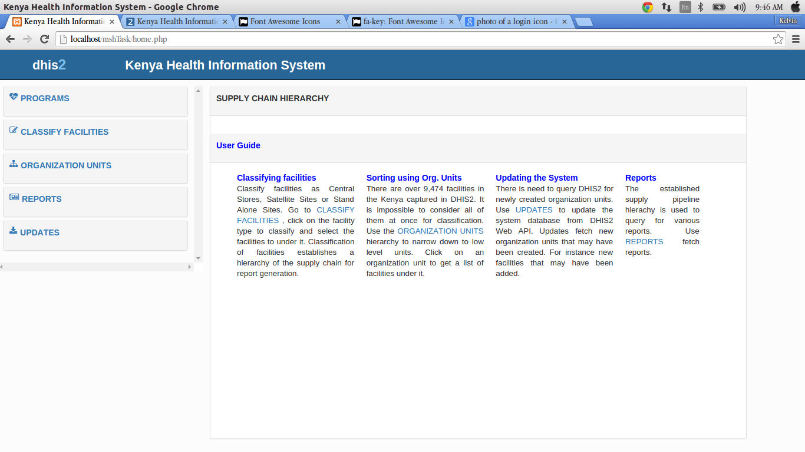
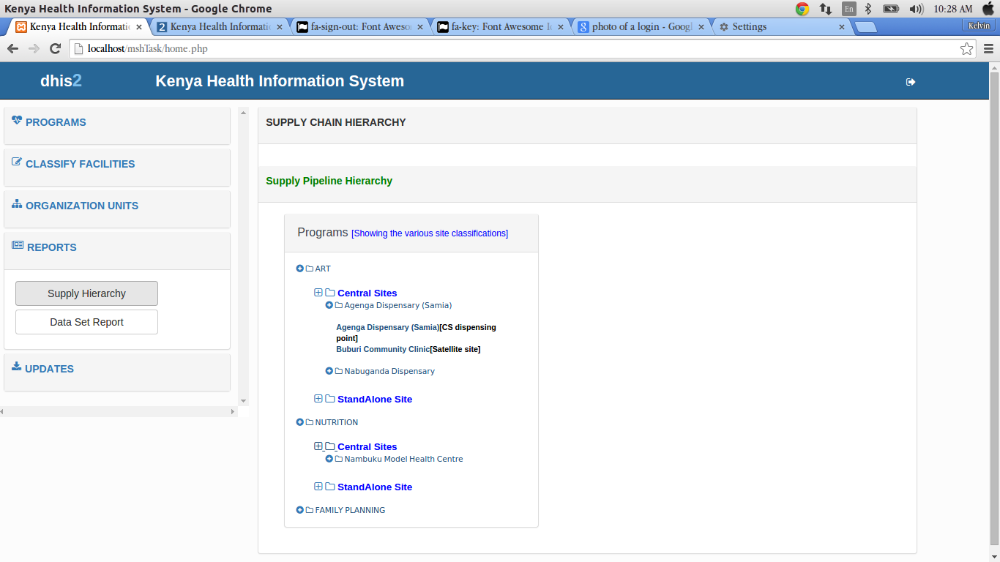
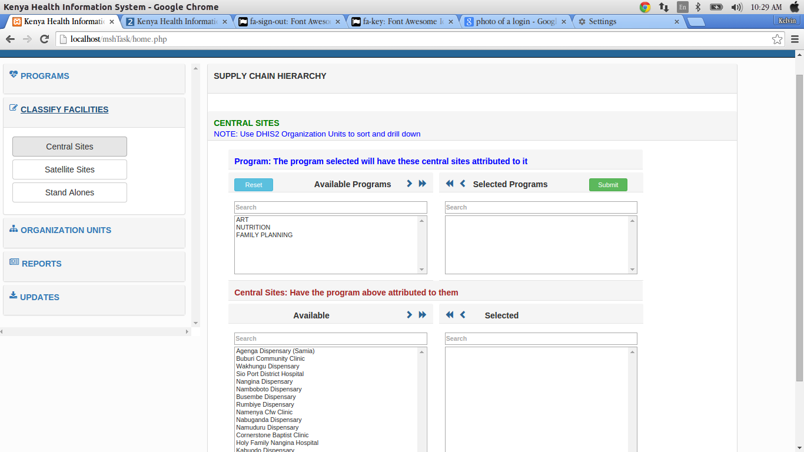
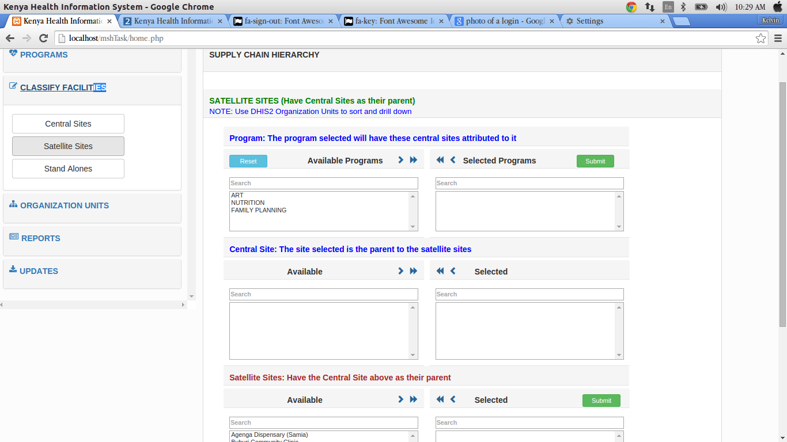
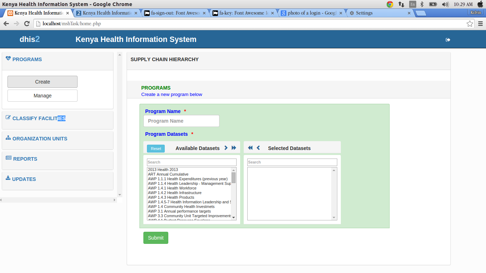

User guide
===========

Introduction
------------
Managing supply chains in support of HIV/AIDS services is a formidable challenge, especially in developing countries. Expanding programs for HIV/AIDS, TB and malaria require strong and supportive laboratory services that depend on the availability of the required commodities to perform critical tests, with most tests requiring multiple commodities to be available simultaneously. A correctly designed and run distribution system should keep the commodities in good condition, rationalize storage points, use transport as efficiently as possible, reduce theft and fraud and provide information for forecasting needs. This requires a good management of the system along with a simple but well-designed information system in place. 
The purpose of this project is to establish an hierarchy of the drugs supply chain that is not captured in DHIS2 for purposes of analysis and report generation.

As things stand, the Kenya instance of `DHIS2`_ only establishes a hierarchy based on the country's administrative units which while important, does not capture the supply chain hierarchy.
The drug supply hierarchy needs to place facilities in their correct order clearly showing the reporting chain ie what facilities report to what and what facilities are children so to speak of what facilities.

.. _`DHIS2`: http://test.hiskenya.org/dhis-web-commons/security/login.action;jsessionid=720CD1B3E45168E4E27916FA020C6887

Getting started
---------------
The purpose of this application is to establish an hierarchy of the drugs supply chain that is not captured in DHIS2 for purposes of analysis and report generation.

System requirements
~~~~~~~~~~~~~~~~~~~
Chrome browser is recommended for the application. This is because of the javascript that is used in the app.
Its able to load faster in chrome.

Login roles to DHIS2 are also required inorder to access the application.

Logging in
+++++++++++++
You have to login to `DHIS2`_ first:

.. code-block:: javascript

    {
        "username": "username",
        "password": "password"
    }

.. _`DHIS2`: http://test.hiskenya.org/dhis-web-commons/security/login.action;jsessionid=720CD1B3E45168E4E27916FA020C6887

.. note::

    Please note that you must have signed up in DHIS2.

Secondly, you must login to the application itself. Here is the login page:

.. figure:: images/homepage.png

A successful login will lead you to using the application.

Permissions
~~~~~~~~~~~~~

Login roles
++++++++++++
There are various user roles according to the user who is logged in.

Users can either:
     #. View/generate reports.
     #. Categorise or group facilities according to their hierarchies. 

Launching the web application
-----------------------------
This application is launched as a stand alone app, because it is not incorporated in DHIS2.

However, it pulls data from DHIS2.

In order to launch the app, you need to type the `url`_ 

.. _`url`: url here

This will direct you to the login page where you can login.

Application layout
------------------
Header
~~~~~~

Side bar
~~~~~~~~

At the rightside bar, there is a list of links:
    
Programs
+++++++++++++

Here you can create and manage programs.

Classify facilities
+++++++++++++++++++++++

Here you can classify facilities according to the hierarchy, either as central stores, satellite sites or stand alone sites.

Go to `Classify facilities`_ ,click on the facility type to classify, then select the facilities to put under the classification.

.. _`Classify facilities`: url here

.. note::

    This establishes a hierarchy of the supply chain for report generation.

Organization units
++++++++++++++++++

This link is used to narrow down to low level units.

Click on `Organization units`_ ,then click on an organization unit to get the list of facilities under it.

 .. _`Organization units`: url here

Reports
+++++++

Use the `Reports`_ link to query for various reports.

.. _`Reports`: url here

Updates
++++++++

There is need to query DHIS2 for newly updated organization units.

Use `Updates`_ to update the systems database from the DHIS2's web API.

Updates fetch new organization units or facilities that may have been added.

 .. _`Updates`: url here

Here is a screenshot of the application layout

Tasks
------

Get report
~~~~~~~~~~~
Here you can either get supply hierarchy reports or dataset reports.

Generating a supply hierarchy report
++++++++++++++++++++++++++++++++++++

.. :align:center

Generating a dataset report
+++++++++++++++++++++++++++++

.. figure:: images/datasetreport.png

Download report
~~~~~~~~~~~~~~~
Using the link, you can download reports in PDF format.

.. figure:: download.png

Classify facilities
~~~~~~~~~~~~~~~~~~~
This is the classification of facilities according to the facility type chosen, either central store, a satellite site, or a stand alone site. 

Central store classification

Satellite classification

Stand alone classification

Creating programmes
~~~~~~~~~~~~~~~~~~~
This is basically adding a new program and assigning it to a facility.

Trouble shooting
-----------------

Database update
~~~~~~~~~~~~~~~

This involves updating the systems database from the DHIS2 web API inorder to fetch new organization units and facilities that may have been added.

.. toctree::
    :maxdepth: 2
